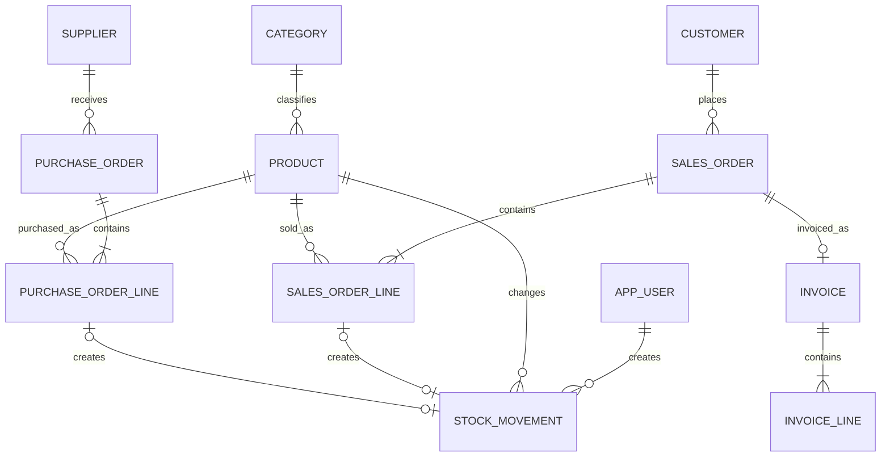

# WAFA Gestion - Database and Domain Model

## 1. Purpose

This document defines the MVP domain model and its relational mapping for WAFA
Gestion. It is the reference for JPA entities, Flyway migrations, database
constraints, indexes, aggregate boundaries, and transactional stock rules.

The model targets PostgreSQL and a Spring Data JPA modular monolith. It favors a
small, normalized schema with explicit history over abstractions needed only by
a larger ERP.

## 2. Review Summary

The recommended model is suitable for the 20-day MVP with the following design
decisions:

- Keep sales orders and purchase orders as separate aggregates. A single generic
  order table would require nullable customer/supplier columns and complicate
  statuses, validation, and JPA mappings.
- Keep customers and suppliers as separate entities. A generic party model with
  role tables is unnecessary for the MVP and would add complexity without a
  current business requirement.
- Model order lines as entities, not as direct many-to-many relationships between
  orders and products. Quantity, price, tax, and line total belong to the
  association and must be retained as transaction history.
- Store `products.current_stock` as the operational balance and keep
  `stock_movements` as an append-only audit ledger. The duplication is deliberate
  and must be protected by one transaction and product-row locking.
- Reference source order lines from stock movements with foreign keys. Do not use
  an unconstrained `source_type` plus `source_id` polymorphic reference.
- Generate invoices as immutable snapshots with their own lines. An invoice must
  not change when a customer or product is later edited.
- Archive master data with an active flag. Never cascade deletion from master
  data to commercial documents or stock history.
- Use `BigDecimal`/PostgreSQL `numeric`, never `double` or `float`, for prices,
  tax rates, and totals.
- Keep users simple. There is no role, permission, or user-role table because all
  authenticated users have the same access.

## 3. Modeling Conventions

### 3.1 Identifiers and business numbers

- Every table uses a surrogate `BIGINT` primary key generated by the database.
- Surrogate IDs are internal and are not shown as document references.
- Products use a unique SKU/reference.
- Sales orders, purchase orders, and invoices each use a unique, immutable
  business number generated by the backend.
- Business numbers must not be generated with `MAX(number) + 1`. A database
  sequence or another concurrency-safe generator shall be used.
- Gaps in business-number sequences are acceptable for the MVP. Gapless legal
  invoice numbering requires separate regulatory validation and is outside the
  current scope.

### 3.2 Common columns

Mutable master and draft transaction tables should contain:

| Column | PostgreSQL type | Rule |
| --- | --- | --- |
| `id` | `BIGINT` | Primary key |
| `created_at` | `TIMESTAMPTZ` | Not null, assigned on insert |
| `updated_at` | `TIMESTAMPTZ` | Not null, updated on change |
| `version` | `BIGINT` | Not null, optimistic-lock version |

Additional conventions:

- Java timestamps use `Instant`; business dates use `LocalDate`.
- Timestamps are stored as `TIMESTAMPTZ` and displayed in the configured Morocco
  time zone.
- Required text is trimmed before persistence and is protected by both `NOT NULL`
  and non-blank checks where important.
- Enum values are persisted as readable strings with `EnumType.STRING`, never by
  ordinal. Database `CHECK` constraints limit accepted values.
- String lengths are bounded in migrations and in Bean Validation.
- Flyway migrations own the schema. Hibernate schema auto-update must not be used
  outside disposable local tests.

### 3.3 Numeric conventions

| Concept | Java type | PostgreSQL type | Rules |
| --- | --- | --- | --- |
| Money | `BigDecimal` | `NUMERIC(19,2)` | MAD, scale 2, non-negative |
| Tax rate | `BigDecimal` | `NUMERIC(5,2)` | Percentage from 0.00 to 100.00 |
| Quantity | `Long` | `BIGINT` | Whole units, positive on lines |
| Stock balance | `Long` | `BIGINT` | Zero or positive |

The MVP treats a product's unit of measure as an indivisible stock unit such as
`PIECE`, `BOX`, or `PACK`. Fractional quantities are not required. If they become
a real requirement, all quantity and stock columns must be migrated together to
`NUMERIC(19,3)` and mapped consistently to `BigDecimal`.

All monetary calculations occur in the backend with `BigDecimal`. Values are
rounded to scale 2 using one documented rounding mode, recommended
`RoundingMode.HALF_UP`. Calculations follow:

1. `line_subtotal = quantity * unit_price`
2. `line_tax = round(line_subtotal * tax_rate / 100, 2)`
3. `line_total = line_subtotal + line_tax`
4. Header totals equal the sum of their corresponding line values.

The frontend may display estimates, but persisted totals are always calculated
by the backend.

## 4. Entity Model

### 4.1 Relationship overview

The diagram shows business cardinalities. The database cannot guarantee that an
order or invoice has at least one line using a simple foreign key; that invariant
is enforced by the application service in the same transaction.

### 4.2 `app_users`

Authentication identity only. There is no authorization model beyond being
authenticated.

| Column | Type | Null | Notes |
| --- | --- | --- | --- |
| `id` | `BIGINT` | No | Primary key |
| `username` | `VARCHAR(80)` | No | Case-insensitive unique login name |
| `email` | `VARCHAR(254)` | No | Case-insensitive unique email |
| `password_hash` | `VARCHAR(255)` | No | BCrypt or configured password hash |
| `active` | `BOOLEAN` | No | Defaults to `true` |
| `created_at` | `TIMESTAMPTZ` | No | Audit timestamp |
| `updated_at` | `TIMESTAMPTZ` | No | Audit timestamp |
| `version` | `BIGINT` | No | Optimistic locking |

No `roles`, `permissions`, or join tables shall be created for the MVP. The
initial user is inserted through controlled seed/setup data with a precomputed
password hash.

### 4.3 `categories`

| Column | Type | Null | Notes |
| --- | --- | --- | --- |
| `id` | `BIGINT` | No | Primary key |
| `name` | `VARCHAR(120)` | No | Case-insensitive unique name |
| `description` | `VARCHAR(500)` | Yes | Optional description |
| `active` | `BOOLEAN` | No | Defaults to `true` |
| `deactivated_at` | `TIMESTAMPTZ` | Yes | Set when archived |
| Common audit columns | | | See section 3.2 |

A category has zero or many products. Every product has exactly one category.
An inactive category remains referenced by existing products.

### 4.4 `products`

| Column | Type | Null | Notes |
| --- | --- | --- | --- |
| `id` | `BIGINT` | No | Primary key |
| `sku` | `VARCHAR(80)` | No | Case-insensitive unique reference |
| `name` | `VARCHAR(180)` | No | Product name |
| `category_id` | `BIGINT` | No | FK to `categories` |
| `unit_of_measure` | `VARCHAR(30)` | No | Allowed MVP unit value |
| `purchase_price` | `NUMERIC(19,2)` | No | Current default purchase price |
| `selling_price` | `NUMERIC(19,2)` | No | Current default selling price |
| `current_stock` | `BIGINT` | No | Defaults to `0`, never negative |
| `minimum_stock` | `BIGINT` | No | Defaults to `0`, never negative |
| `active` | `BOOLEAN` | No | Defaults to `true` |
| `deactivated_at` | `TIMESTAMPTZ` | Yes | Set when archived |
| Common audit columns | | | See section 3.2 |

`purchase_price` and `selling_price` are defaults for new order lines, not
transaction history. Each order line stores the selected price independently.
`current_stock` must never be changed through the normal product update path.

### 4.5 `customers`

| Column | Type | Null | Notes |
| --- | --- | --- | --- |
| `id` | `BIGINT` | No | Primary key |
| `name` | `VARCHAR(180)` | No | Person or company display name |
| `ice` | `VARCHAR(30)` | Yes | Moroccan business identifier |
| `contact_person` | `VARCHAR(180)` | Yes | Optional contact |
| `email` | `VARCHAR(254)` | Yes | Optional normalized email |
| `phone` | `VARCHAR(30)` | Yes | Stored as text, not numeric |
| `address` | `VARCHAR(500)` | Yes | Single MVP billing address |
| `active` | `BOOLEAN` | No | Defaults to `true` |
| `deactivated_at` | `TIMESTAMPTZ` | Yes | Set when archived |
| Common audit columns | | | See section 3.2 |

`ice` should be unique when present if WAFA BUREAU confirms that it is always a
reliable identifier. PostgreSQL must use a partial unique index so multiple null
values remain valid. The MVP keeps one address inline; a separate address table
would be over-normalization until multiple billing or delivery addresses exist.

### 4.6 `suppliers`

`suppliers` has the same contact columns and audit strategy as `customers`, but
it remains a separate business entity. A supplier has zero or many purchase
orders, while each purchase order has exactly one supplier.

The optional `ice` uniqueness rule is the same as for customers. It is not unique
across the customer and supplier tables because the same company may validly
appear in both capacities.

### 4.7 `sales_orders`

| Column | Type | Null | Notes |
| --- | --- | --- | --- |
| `id` | `BIGINT` | No | Primary key |
| `order_number` | `VARCHAR(40)` | No | Unique, immutable business number |
| `customer_id` | `BIGINT` | No | FK to `customers` |
| `order_date` | `DATE` | No | Business date |
| `status` | `VARCHAR(20)` | No | `DRAFT`, `CONFIRMED`, `CANCELLED` |
| `subtotal` | `NUMERIC(19,2)` | No | Sum before tax |
| `tax_amount` | `NUMERIC(19,2)` | No | Sum of line taxes |
| `total_amount` | `NUMERIC(19,2)` | No | Subtotal plus tax |
| `note` | `VARCHAR(1000)` | Yes | Optional internal note |
| `confirmed_at` | `TIMESTAMPTZ` | Yes | Required when confirmed |
| `created_by_user_id` | `BIGINT` | No | FK to `app_users` |
| Common audit columns | | | See section 3.2 |

### 4.8 `sales_order_lines`

| Column | Type | Null | Notes |
| --- | --- | --- | --- |
| `id` | `BIGINT` | No | Primary key |
| `sales_order_id` | `BIGINT` | No | FK to `sales_orders` |
| `product_id` | `BIGINT` | No | FK to `products` |
| `quantity` | `BIGINT` | No | Greater than zero |
| `unit_price` | `NUMERIC(19,2)` | No | Price fixed for this sale |
| `tax_rate` | `NUMERIC(5,2)` | No | Percentage fixed for this sale |
| `line_subtotal` | `NUMERIC(19,2)` | No | Calculated by backend |
| `line_tax` | `NUMERIC(19,2)` | No | Calculated by backend |
| `line_total` | `NUMERIC(19,2)` | No | Calculated by backend |

A sales order has one or many lines. In the MVP, the same product should appear
at most once in an order, enforced by `UNIQUE (sales_order_id, product_id)`.
Draft line rows are owned by the order and may be replaced or removed while the
order remains draft. Confirmed order lines are immutable.

### 4.9 `purchase_orders` and `purchase_order_lines`

`purchase_orders` mirrors the sales header structure with these differences:

- `supplier_id` replaces `customer_id`;
- allowed statuses are `DRAFT`, `RECEIVED`, and `CANCELLED`; and
- `received_at` replaces `confirmed_at`.

`purchase_order_lines` mirrors sales lines, with a `purchase_order_id` foreign
key and a unit price representing the purchase price. It uses
`UNIQUE (purchase_order_id, product_id)`. A received order and its lines are
immutable.

Separate tables avoid nullable party references and prevent sales-only and
purchase-only state transitions from being mixed.

### 4.10 `stock_movements`

`stock_movements` is an append-only ledger. One row represents the stock effect
for one product and one source line or manual adjustment.

| Column | Type | Null | Notes |
| --- | --- | --- | --- |
| `id` | `BIGINT` | No | Primary key |
| `product_id` | `BIGINT` | No | FK to `products` |
| `movement_type` | `VARCHAR(30)` | No | See allowed values below |
| `quantity_delta` | `BIGINT` | No | Signed and never zero |
| `stock_before` | `BIGINT` | No | Balance before this movement |
| `stock_after` | `BIGINT` | No | Balance after this movement |
| `sales_order_line_id` | `BIGINT` | Yes | FK to `sales_order_lines` |
| `purchase_order_line_id` | `BIGINT` | Yes | FK to `purchase_order_lines` |
| `reason` | `VARCHAR(180)` | Yes | Required for manual adjustments |
| `note` | `VARCHAR(1000)` | Yes | Optional detail |
| `created_by_user_id` | `BIGINT` | No | FK to `app_users` |
| `occurred_at` | `TIMESTAMPTZ` | No | Immutable event timestamp |

Allowed movement types are:

- `SALE`: negative delta, exactly one sales order line, no purchase order line;
- `PURCHASE`: positive delta, exactly one purchase order line, no sales order
  line;
- `MANUAL_IN`: positive delta, neither order-line reference, reason required;
- `MANUAL_OUT`: negative delta, neither order-line reference, reason required.

Database checks shall also require:

- `stock_before >= 0`;
- `stock_after >= 0`;
- `stock_after = stock_before + quantity_delta`; and
- the sign and nullable source columns to match `movement_type`.

Unique partial indexes on non-null `sales_order_line_id` and
`purchase_order_line_id` guarantee that confirming or receiving an order cannot
create a second stock movement for the same line. These constraints provide a
database-level idempotency safeguard in addition to status checks.

An update/delete-rejecting database trigger is recommended for this table. If a
trigger is not included in the MVP, immutability must still be protected by no
update/delete repository operations, no corresponding API endpoints, restricted
database credentials, and integration tests. The trigger is preferable because
history integrity should not depend only on application discipline.

### 4.11 `invoices`

| Column | Type | Null | Notes |
| --- | --- | --- | --- |
| `id` | `BIGINT` | No | Primary key |
| `invoice_number` | `VARCHAR(40)` | No | Unique, immutable number |
| `sales_order_id` | `BIGINT` | No | Unique FK to `sales_orders` |
| `issue_date` | `DATE` | No | Invoice business date |
| `customer_name` | `VARCHAR(180)` | No | Snapshot |
| `customer_ice` | `VARCHAR(30)` | Yes | Snapshot |
| `customer_email` | `VARCHAR(254)` | Yes | Snapshot |
| `customer_phone` | `VARCHAR(30)` | Yes | Snapshot |
| `customer_address` | `VARCHAR(500)` | Yes | Snapshot |
| `subtotal` | `NUMERIC(19,2)` | No | Snapshot total |
| `tax_amount` | `NUMERIC(19,2)` | No | Snapshot total |
| `total_amount` | `NUMERIC(19,2)` | No | Snapshot total |
| `created_by_user_id` | `BIGINT` | No | FK to `app_users` |
| `created_at` | `TIMESTAMPTZ` | No | Generation timestamp |

The unique `sales_order_id` implements the sales-order-to-invoice cardinality:
a confirmed sales order has zero or one invoice, and each invoice belongs to
exactly one sales order.

### 4.12 `invoice_lines`

| Column | Type | Null | Notes |
| --- | --- | --- | --- |
| `id` | `BIGINT` | No | Primary key |
| `invoice_id` | `BIGINT` | No | FK to `invoices` |
| `line_number` | `INTEGER` | No | Stable print order, starts at 1 |
| `product_sku` | `VARCHAR(80)` | No | Snapshot |
| `product_name` | `VARCHAR(180)` | No | Snapshot |
| `unit_of_measure` | `VARCHAR(30)` | No | Snapshot |
| `quantity` | `BIGINT` | No | Snapshot, greater than zero |
| `unit_price` | `NUMERIC(19,2)` | No | Snapshot |
| `tax_rate` | `NUMERIC(5,2)` | No | Snapshot |
| `line_subtotal` | `NUMERIC(19,2)` | No | Snapshot |
| `line_tax` | `NUMERIC(19,2)` | No | Snapshot |
| `line_total` | `NUMERIC(19,2)` | No | Snapshot |

Invoice lines intentionally do not require a product foreign key. Their purpose
is to preserve the issued document even if master data is archived or renamed.
`UNIQUE (invoice_id, line_number)` preserves stable line ordering.

## 5. Normalization and Historical Data

The operational model is in third normal form for the MVP:

- Categories are referenced rather than copied into products.
- Customer and supplier data is stored once in its relevant master table.
- Order headers do not repeat line-level values.
- Order lines resolve the order-to-product many-to-many relationship and retain
  transaction-specific quantity, price, and tax.
- Stock movements reference products and concrete source lines rather than
  copying whole documents.

There are three intentional denormalizations:

1. `products.current_stock` caches the latest balance for fast validation and
   display; `stock_movements` retains its history.
2. Header and line totals are stored so confirmed commercial documents preserve
   the exact rounded values used at the time of confirmation.
3. Invoices copy customer and product presentation fields because invoices are
   immutable historical documents, not live views of master data.

These duplicates must only be written by domain/application services. They are
not evidence that customer, supplier, product, or address data should be copied
into ordinary draft orders.

## 6. JPA Mapping Rules

### 6.1 Associations

- All `@ManyToOne` and `@OneToOne` relationships shall be explicitly `LAZY`.
- Order-to-line and invoice-to-line relationships are bidirectional aggregate
  ownership mappings: parent `@OneToMany(mappedBy = ...)`, child `@ManyToOne`.
- Cascades and `orphanRemoval = true` are allowed only from a draft order to its
  lines and from an invoice to its lines.
- No cascade remove shall exist from category, product, customer, supplier, or
  user relationships.
- Master entities do not need large inverse collections such as all customer
  orders or all product movements. Queries should load those separately with
  pagination.
- API DTOs shall be mapped explicitly. JPA entities must not be serialized
  directly, avoiding recursion, accidental lazy loading, and over-posting.

### 6.2 Aggregate boundaries

- `SalesOrder` owns `SalesOrderLine` entities.
- `PurchaseOrder` owns `PurchaseOrderLine` entities.
- `Invoice` owns `InvoiceLine` entities.
- `Product` owns its current balance but does not own stock movement rows.
- `StockMovement` is an immutable ledger entity created by the inventory service.
- Category, customer, supplier, product, and user references are associations,
  not aggregate ownership.

An order-line collection may be changed only while its parent is `DRAFT`.
Replacing lines must use helper methods that maintain both sides of the JPA
association. Fetch joins or entity graphs should be used for explicit detail
queries; changing associations to eager loading is not an acceptable N+1 fix.

### 6.3 Equality and locking

- Entity equality must not depend on mutable business fields or association
  collections. Use a stable generated-ID strategy suitable for Hibernate.
- Mutable aggregate roots and products include `@Version` for optimistic locking.
- Stock mutation additionally requires a database row lock on each affected
  product because a read-check-write sequence must be serialized.

## 7. Stock Integrity and Transactions

### 7.1 Source of truth

`products.current_stock` is the authoritative balance used by operational reads
and availability checks. The append-only movement ledger is the authoritative
history explaining that balance. For every product, the invariant is:

`current_stock = sum(stock_movements.quantity_delta)`

Because every product starts at zero and initial stock is a manual movement, no
unexplained opening balance is needed.

### 7.2 Required transaction boundary

Sales confirmation, purchase receipt, and manual adjustment each run in one
backend transaction:

1. Load the order when applicable and verify its expected current status.
2. Lock all affected product rows using `PESSIMISTIC_WRITE`, in ascending product
   ID order to reduce deadlock risk.
3. Revalidate product activity, quantities, and available stock under the locks.
4. Calculate the new balances and reject any negative result.
5. Update each product balance.
6. Insert one stock movement per order line, or one movement for a manual
   adjustment, including before/after balances.
7. Change the order status and set its confirmation/receipt timestamp.
8. Commit all changes together; any failure rolls back all changes.

The unique source-line indexes and status transition rules make retries safe. A
request must never update order status in one transaction and stock in another.

For multi-line orders, line processing should follow the same sorted product ID
order used for locking. Duplicate products within an order are disallowed, which
also simplifies locking and movement traceability.

### 7.3 Reconciliation

A read-only reconciliation query or integration test shall compare every
product's `current_stock` with the sum of its movement deltas. A mismatch is a
data-integrity incident and must not be repaired by directly editing the product.
The cause should be identified and a traceable correcting movement created when
appropriate.

## 8. Deletion and Archive Strategy

| Data | Strategy |
| --- | --- |
| Users | Deactivate; never delete a referenced user |
| Categories | Deactivate when referenced; hard delete only if never referenced |
| Products | Deactivate when referenced; hard delete only if never referenced and stock is zero |
| Customers | Deactivate when referenced; hard delete only if never referenced |
| Suppliers | Deactivate when referenced; hard delete only if never referenced |
| Draft orders | Prefer cancellation; hard delete is optional only before any external effect |
| Confirmed/received orders and lines | Never delete or edit |
| Stock movements | Never delete or edit |
| Invoices and invoice lines | Never delete or edit |

Archiving uses `active = false` and `deactivated_at`; it is not a generic
`deleted` flag applied to every table. Queries for new transactions must select
active master data, while historical queries must still resolve inactive records.
Global Hibernate filters such as `@Where(active = true)` are discouraged because
they can silently hide historical relationships.

Foreign keys use `ON DELETE RESTRICT`/`NO ACTION` for master and transaction
references. Database cascades cannot distinguish a draft order from a confirmed
one, so draft child rows are removed explicitly through the JPA aggregate before
the draft parent is deleted. Application checks improve error messages, but
database foreign keys remain the final protection.

## 9. Database Constraints

### 9.1 Required constraints

- Primary keys on every table.
- Foreign keys for every `*_id` association.
- `NOT NULL` on required fields, totals, statuses, timestamps, and active flags.
- Case-insensitive unique indexes on normalized username, email, category name,
  and product SKU.
- Unique constraints on sales order number, purchase order number, invoice
  number, and invoice sales order.
- Unique constraints preventing the same product twice within one order.
- Unique partial indexes preventing more than one movement per source order line.
- Checks that money is non-negative and tax rates are between 0 and 100.
- Checks that order-line and invoice-line quantities are positive.
- Checks that product stock and stock threshold are non-negative.
- Checks that each line total equals its line subtotal plus line tax.
- Checks that header `total_amount = subtotal + tax_amount`.
- Checks that `confirmed_at` is present exactly for a `CONFIRMED` sales order and
  `received_at` is present exactly for a `RECEIVED` purchase order.
- Checks limiting statuses, movement types, and units of measure to supported
  values.
- Stock movement sign, source, reason, and before/after consistency checks from
  section 4.10.

### 9.2 Application-level invariants

The following cross-row or state-transition rules cannot be expressed reliably
with ordinary row constraints and shall be enforced in transactional services:

- an order or invoice contains at least one line;
- header totals equal the sum of line totals;
- only draft orders can be edited or cancelled;
- only a draft sales order can become confirmed;
- only a draft purchase order can become received;
- only a confirmed sales order can be invoiced;
- referenced products and business partners are active when a new document is
  created or confirmed;
- stock is sufficient for the complete sales order; and
- current stock and movement history are updated atomically.

Each critical invariant requires integration tests against PostgreSQL. Bean
Validation alone is not a database integrity mechanism.

## 10. Index Strategy

PostgreSQL does not automatically index foreign-key columns. The following
indexes are recommended in addition to primary-key and unique indexes:

| Table | Index columns | Purpose |
| --- | --- | --- |
| `products` | `(category_id)` | Products by category and FK operations |
| `products` | `(active, name)` | Active product lists |
| `customers` | `(active, name)` | Active customer lists |
| `suppliers` | `(active, name)` | Active supplier lists |
| `sales_orders` | `(customer_id, order_date DESC)` | Customer history |
| `sales_orders` | `(status, order_date DESC)` | Status lists and dashboard |
| `purchase_orders` | `(supplier_id, order_date DESC)` | Supplier history |
| `purchase_orders` | `(status, order_date DESC)` | Status lists and dashboard |
| `sales_order_lines` | `(product_id)` | Product references and FK operations |
| `purchase_order_lines` | `(product_id)` | Product references and FK operations |
| `stock_movements` | `(product_id, occurred_at DESC)` | Product movement history |
| `stock_movements` | `(movement_type, occurred_at DESC)` | Type/date filtering |
| `stock_movements` | `(created_by_user_id)` | FK operations and audit queries |
| `invoices` | `(issue_date DESC)` | Invoice list and date filtering |
| `invoices` | `(created_by_user_id)` | FK operations |

All other foreign keys, including header creator and party columns, should be
reviewed and indexed when their parent-side delete checks or query patterns need
them.

For case-insensitive uniqueness, use unique indexes on normalized expressions
such as `lower(trim(sku))`; normalize the same way in the application. Optional
ICE uniqueness uses a partial unique index limited to non-null, non-blank values.

Simple `LIKE '%term%'` search does not benefit from ordinary B-tree indexes. The
MVP dataset is expected to be small, so no PostgreSQL extension is required. Add
`pg_trgm` GIN indexes only after measuring a real search-performance problem.
Likewise, low stock compares two columns (`current_stock <= minimum_stock`) and
does not justify a stored status column for the MVP.

Indexes have write and storage costs. Do not add indexes for every column or
duplicate indexes already supplied by unique constraints.

## 11. Transaction History Policy

Commercial history consists of:

- immutable confirmed sales orders and their price/tax lines;
- immutable received purchase orders and their price/tax lines;
- immutable stock movements with before/after balances and concrete sources; and
- immutable invoice snapshots.

Drafts are working data, not final history. The system records `created_at`,
`updated_at`, creator, and confirmation/receipt timestamps, but a complete audit
trail of every draft edit is outside the MVP.

Stock movement notes do not replace structured source links. Conversely, invoice
snapshots deliberately remain valid without live product links. These different
choices reflect different historical purposes and should not be unified into a
generic audit/event table.

## 12. Flyway and Schema Validation

- The first Flyway migration creates tables in dependency order, followed by
  constraints and indexes.
- Seed data is separated from structural migrations and is clearly restricted to
  development/demo use where appropriate.
- Later schema changes are additive migrations; an applied migration is never
  edited.
- Hibernate should run with schema validation in normal development and
  deployment so JPA mappings cannot silently diverge from Flyway.
- Constraint and index names should be explicit and consistent, for example
  `fk_sales_order_customer`, `uk_product_sku`, and
  `ck_stock_movement_balance`.
- Integration tests should use PostgreSQL, preferably through Testcontainers,
  for constraint, locking, and transaction behavior that an in-memory database
  cannot accurately reproduce.

## 13. Out-of-Scope Schema

The MVP shall not add tables for roles, permissions, refresh tokens, warehouses,
stock reservations, lots, serial numbers, payments, accounting entries, returns,
credit notes, currencies, exchange rates, product images, addresses, or document
attachments. Such tables should be introduced only with an approved functional
requirement and a migration plan.
